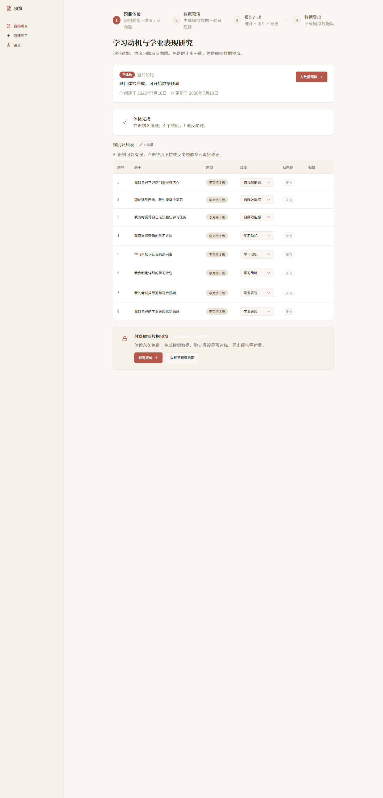
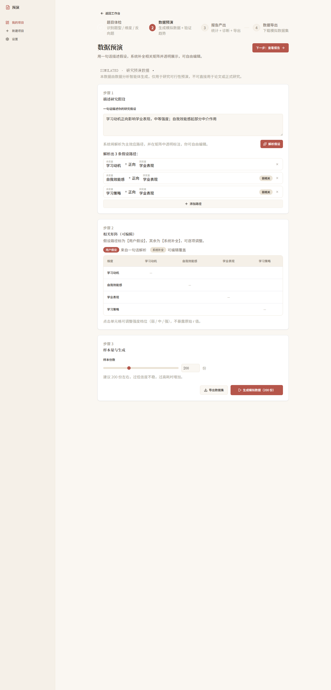
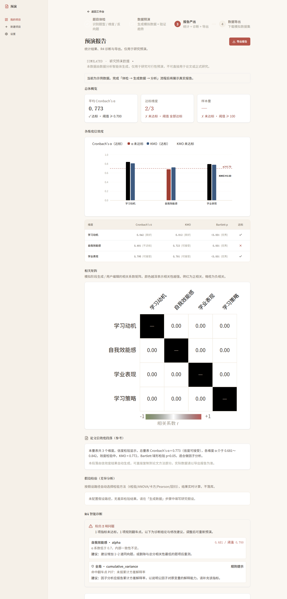
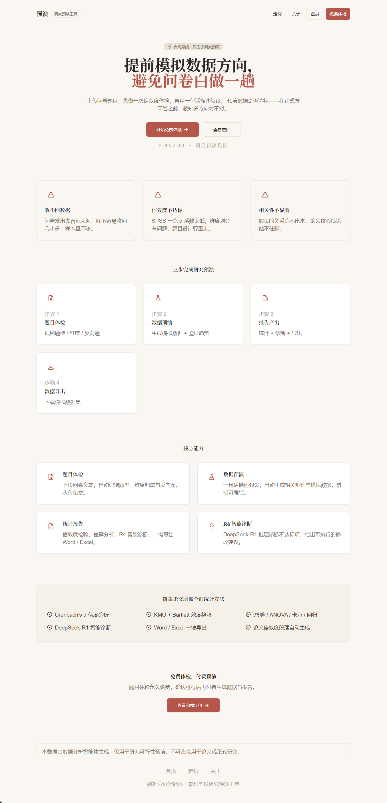
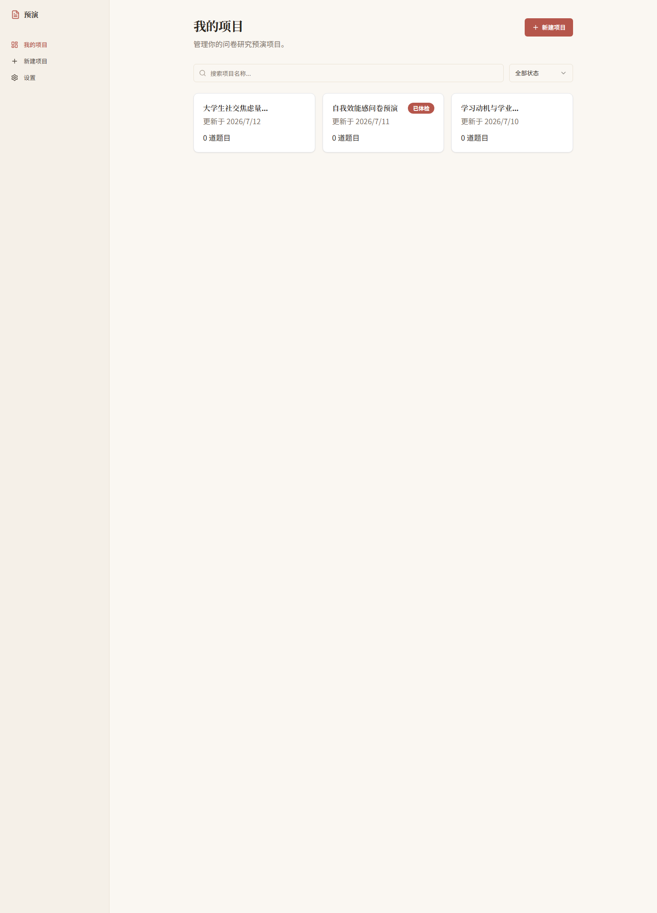
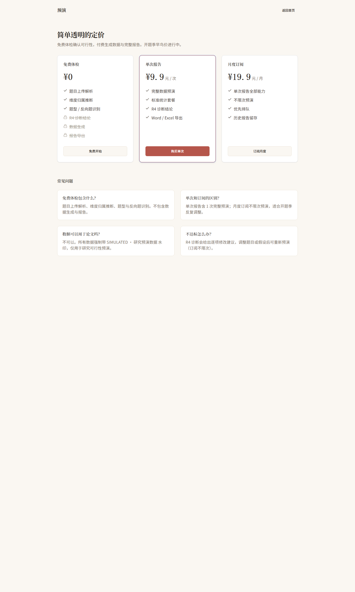
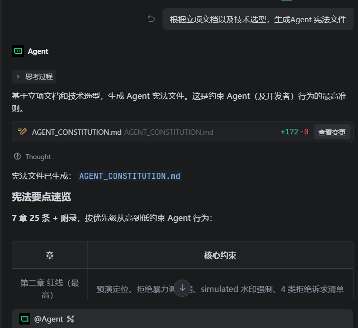
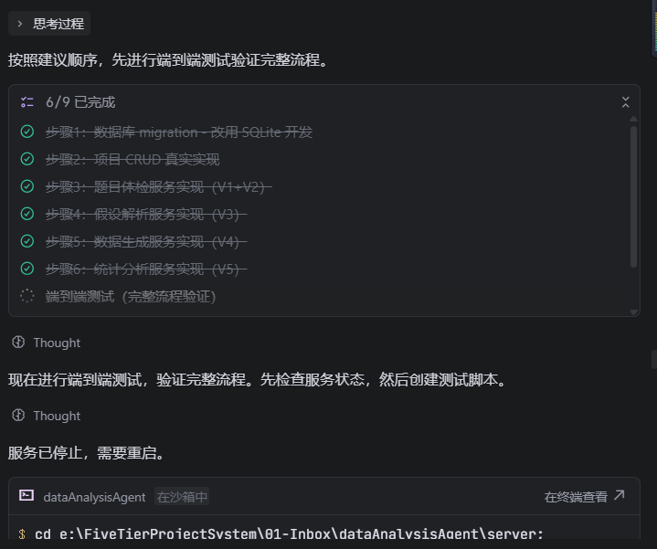
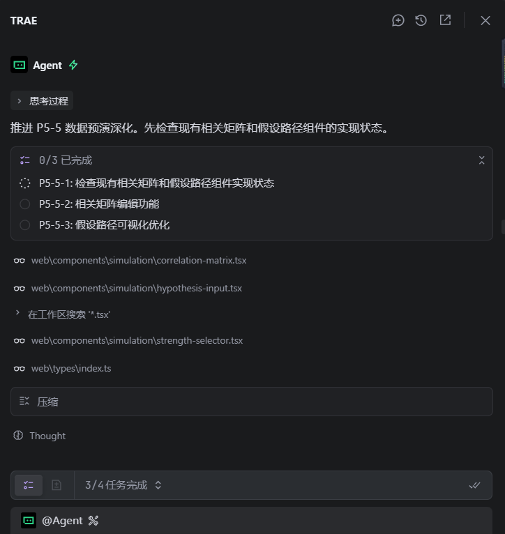
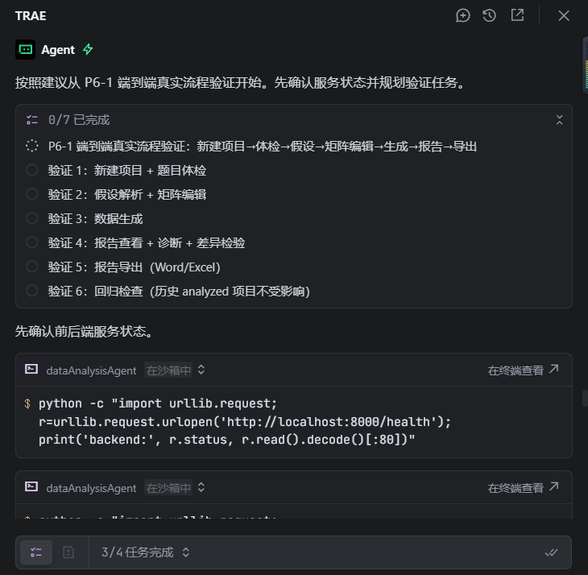

# 参赛提交

---

## 【标签】

学习工作

---

## 【标题】

学习工作赛道 - 预演：面向本科毕设生的问卷研究预演工具

---

## 【正文】

### 1. Demo 简介

**是什么**：预演是一款 Web SaaS 形态的问卷研究预演工具（网站），帮用户在问卷正式发放前，提前模拟数据方向与统计趋势，判断"这份问卷值不值得发"。

**面向谁**：核心用户是本科毕设生（开题季 9-11 月、答辩季 3-5 月为流量峰值），典型场景是使用李克特 5/7 级成熟量表、需要跑信效度+相关+差异检验标准统计套餐的文科与社科类学生。

**主要功能**（三大核心闭环）：

1. **题目体检（R1~R3，永久免费）**：上传 Word / 纯文本问卷，LLM 自动识别题型、推断维度归属、标记反向题，输出「题目×维度归属表」并标注【明确归属】vs【存疑待确认】，用户可在表格中下拉修改维度、点击 Badge 切换反向题方向。

   

2. **数据预演（假设解析 + 透明矩阵 + 模拟生成）**：用户用一句话写假设（如"学习动机正向影响学业表现，中等强度"），系统解析为主效应路径 + 强度档位（对齐 Cohen 国际标准 r 0.1/0.3/0.5），并可视化 N×N 相关矩阵。矩阵区分【你的假设】vs【系统补全】，单元格可点击编辑强度与方向，底部支持新增假设路径。确认后按指定份数生成模拟数据集。

   

3. **统计报告（信效度 + 差异检验 + R4 智能诊断 + 一键导出）**：自动跑 Cronbach's α 信度、KMO+Bartlett 效度、t/ANOVA/卡方/回归差异检验，结果带分档等级（良好/可接受/不达标）与自然语言解读。DeepSeek-R1 推理模型对不达标项给出因果诊断与修改建议。报告页含纯 SVG 可视化（信效度柱状图、相关热力图、效应量图），一键导出 Word + Excel（含 simulated 水印）。

   

**补充界面展示**：

| 界面 | 说明 | 截图 |
|------|------|------|
| 营销首页 | Hero 区域 + 三步流程 + 核心能力卡片 |  |
| 工作台-项目列表 | 项目状态卡片、搜索筛选、新建项目入口 |  |
| 定价页 | 三层定价（免费体检 / 9.9 单次 / 19.9 月度订阅） |  |

---

### 2. Demo 创作思路

**灵感来源**：观察到大量本科毕设生在问卷研究上陷入"发出去石沉大海 → 收回来信效度不达标 → 相关性不显著 → 推翻重来"的死循环。答辩季前两周才跑 SPSS 发现 α 系数过低、维度划分有问题，已经来不及重新发放问卷，只能硬着头皮写或者被迫造假。

**想解决的问题**：用户真实存在的痛点链是——

- **收不回数据**：问卷发出去石沉大海，好不容易收回几十份，样本量不够；
- **信效度不达标**：SPSS 一跑 α 系数太低，维度划分有问题，题目设计要重来；
- **相关性不显著**：假设的关系跑不出来，论文核心结论站不住脚。

现有工具（SPSS、问卷星分析、Python 统计库）都是「事后验证」范式——先把数据收回来再分析。而本产品做的是「事前预演」范式：在问卷发放前就模拟出数据方向，提前发现设计硬伤。

**为什么做这个方向**：

1. **范式转换是品类级机会**：竞品都在分析"已有数据"，本产品帮用户判断"还没发的问卷值不值得发"，差异化清晰；
2. **合规护城河**：坚守"研究预演"定位（A 路线），拒绝"题目不改强行造达标数据"的学术造假诉求（B 路线），全程 simulated 水印 + 免责声明，建立正向口碑；
3. **双模型架构的技术卖点**：DeepSeek-V3 做理解/推断/解析（快、便宜、中文够用），DeepSeek-R1 推理模型做硬伤诊断（思维链适合因果诊断），"国内首个用推理模型做问卷诊断的预演工具"；
4. **透明展示避免黑箱**：LLM 推断 + 可视化矩阵 + 可编辑，所有 AI 产出都可被用户审查与修改，而非黑箱一键生成。

---

### 3. Demo 体验地址

**当前状态**：本地开发环境已完成全链路打通（后端 FastAPI :8000 + 前端 Next.js :3000 + SQLite WAL），尚未部署到公网。

体验方式选择：

- **方案 A（推荐，部署后公开访问）**：待部署到公网后提供链接 `https://your-domain.com`
- **方案 B（交互式 HTML 打包）**：由于本产品为全栈 SaaS（前端 + Python 后端 + LLM 调用），无法打包为单一 HTML 文件体验
- **方案 C（演示视频）**：`./screenshots/demo-video.md` 中附演示视频脚本，可按脚本录屏后上传第三方平台

**本地体验步骤**（评审如需本地运行）：

```bash
# 1. 后端
cd server
python -m venv venv && venv\Scripts\activate
pip install -r requirements.txt
# 配置 .env（DEEPSEEK_API_KEY、JWT_SECRET_KEY、DATABASE_URL=sqlite+aiosqlite:///./data_analysis_agent.db）
python -m uvicorn app.main:app --host 0.0.0.0 --port 8000

# 2. 前端
cd web
npm install
# 配置 .env.local（BACKEND_URL=http://localhost:8000、DEV_TOKEN=dev-token）
npm run dev
# 访问 http://localhost:3000
```

> 注：LLM 功能（题目体检、假设解析、R4 诊断）需要 DeepSeek API Key；无 Key 时这些功能不可用，但项目列表、报告页（含示例数据）、矩阵编辑等界面可正常浏览。

---

### 4. TRAE 实践过程

#### 4.1 开发流程总览

本项目从立项到 MVP 验收标准 V1~V9 全部完成，全程使用 TRAE IDE + AI 辅助开发，经历了以下关键阶段：

| 阶段 | 周期 | 核心产出 | Session ID |
|------|------|---------|-----------|
| 立项与架构选型 | 2026-06-30 | 6 轮产品深聊沉淀立项文档、技术选型（Next.js + FastAPI + DeepSeek 双模型）、Agent 宪法、前端骨架、数据库 schema 设计 | `6a4321d2f84bc4d391b40731` |
| 后端核心服务开发 | 2026-07-08 ~ 07-09 | 题目体检 R1~R3、假设解析、数据生成、统计分析、R4 诊断、报告导出、V9 付费门禁、V8 模拟数据导出 | `6a48c46eba9a79b81f611c4d` |
| 前端集成与全链路打通 | 2026-07-10 ~ 07-13 | BFF 路由层 10 条、TanStack Query hooks、P1~P11 系列页面优化、数据分析模板包融合、安全审计修复、端到端验证 | `6a4fa9f039eb8917de9bd1ea` |

#### 4.2 开发关键步骤截图

> **说明**：以下 4 张截图已在 TRAE IDE 中截取对话窗口（展示 AI 辅助开发的关键过程），放置于 `./screenshots/` 目录。每张包含对应 Session ID 标识与关键代码产出。

**截图 1：立项与架构设计阶段** — Agent 宪法与前端骨架搭建



> 对应 Session ID：`6a4321d2f84bc4d391b40731`
> 关键对话：讨论技术选型（Next.js 14 + shadcn/ui + FastAPI + DeepSeek 双模型）、生成 Agent 宪法文件（7 章 25 条）、搭建前端骨架（app/components/lib 三层目录 + cream 设计 tokens + shadcn/ui 组件库）、数据库 schema 设计（12 张表，遵循 1NF/2NF/3NF，4 个反范式字段显式标注同步策略）。

**截图 2：后端核心服务开发阶段** — 题目体检与数据生成



> 对应 Session ID：`6a48c46eba9a79b81f611c4d`
> 关键对话：实现 R1~R3 题目体检服务（题型识别/维度归属/反向题标记）、假设解析服务（一句话→主效应路径+强度档位）、数据生成服务（约束反向生成，α 达标率实测 0.7955）、统计分析引擎（scipy + statsmodels + factor_analyzer + pingouin）、V9 付费门禁（require_paid_plan 依赖）、V8 模拟数据导出（Excel + simulated 水印元数据）。

**截图 3：前端集成与页面优化阶段** — 相关矩阵编辑与报告页



> 对应 Session ID：`6a4fa9f039eb8917de9bd1ea`
> 关键对话：P5-5 相关矩阵编辑功能（onCellClick 回调 + localMatrix 本地状态 + GET 端点重建矩阵）、P1-1 差异检验决策树（5 条决策规则 + 5 种检验方法）、数据分析模板包融合（statistics_constants.py 集中阈值 + diagnosis_rules.py 结构化翻车点）、P11 系列优化（可编辑维度归属表、路径增删改、只读热力图）、后端安全审计修复（JWT 实现 + dev-token 限制 DEBUG 模式 + slowapi 限流 + 请求日志中间件）。

**截图 4：端到端验证阶段** — 三层验证（后端 9 项 + BFF 6 项 + 浏览器 13 项）



> 对应 Session ID：`6a4fa9f039eb8917de9bd1ea`
> 关键对话：test_e2e.py 覆盖主流程 10 步 + 9 条异常分支、BFF 路由 snake_case↔camelCase 转换验证、浏览器交互验证（假设文本回填、路径卡片、矩阵编辑、强度切换）、安全验证（dev-token 认证 401/200、JWT 流程、CORS 配置、限流）。

#### 4.3 关键任务对话 Session ID

以下 Session ID 用于证明作品由 TRAE 开发完成（均可在 TRAE IDE 历史记录中检索）：

| # | Session ID | 对话主题 | 主要产出 |
|---|-----------|---------|---------|
| 1 | `6a4321d2f84bc4d391b40731（.1219784208561017:51c0fca5b2b6791825ae357e70695660_6a4321d2f84bc4d391b40731.6a4377ab8750cf0bcf6feb7b.6a4377a9cad5fb5922521654:Trae CN.T(2026/6/30 16:00:43)、.1219784208561017:9015c82db7cbb15b865cc58a38d24b53_6a4321d2f84bc4d391b40731.6a4379608750cf0bcf6fecad.6a43795fcad5fb5922521655:Trae CN.T(2026/6/30 16:08:00)等）` | 立项、技术选型、前端骨架、数据库设计 | 立项文档、Agent 宪法、前端三层目录结构、cream 设计 tokens、12 张表 schema |
| 2 | `6a48c46eba9a79b81f611c4d（.1219784208561017:fe5969fcfe8fdf678d1771d89f275d36_6a48c46eba9a79b81f611c4d.6a4de45981026d23b90e0ba8.6a4de459655e0e5e91551963:Trae CN.T(2026/7/8 13:47:05)等）` | 后端核心服务开发 | R1~R3 体检、假设解析、数据生成、统计分析、V8/V9 导出与门禁 |
| 3 | `6a4fa9f039eb8917de9bd1ea（.3401220147388492:d0257cb716e6f4f8486b591aea0423aa_6a4fa9f039eb8917de9bd1ea.6a50af5b24bb68ea2b2e3ee0.6a50af579c5810b29375c6df:Trae CN.T(2026/7/10 16:37:47)、.3401220147388492:bbf67a25a24c69839b139dedb8510b0e_6a4fa9f039eb8917de9bd1ea.6a544bd1464a338f2222ff06.6a544bcb20c87a36e97ae029:Trae CN.T(2026/7/13 10:22:09)等）` | 前端集成、模板包融合、安全修复、端到端验证 | BFF 10 条路由、P1~P11 优化、JWT 安全、三层验证通过 |

#### 4.4 开发心得与经验总结

**1. AI 辅助开发的有效边界**

TRAE + AI 在以下场景效率最高：脚手架搭建（前端骨架/数据库 schema/CRUD 模板）、跨语言格式转换（Python snake_case ↔ TypeScript camelCase）、重复性组件生成（shadcn/ui 组件按 design tokens 定制）、测试用例编写（异常分支覆盖）。但在涉及统计正确性的核心逻辑（如效应量档位、KMO 阈值校准）时，必须人工对照学术标准复核——本项目曾出现"立项文档/代码/Cohen 国际标准三方档位不一致"的陷阱，最终通过明确"名义值 vs 内部补偿值"分离口径解决。

**2. 设计 tokens 驱动的 UI 一致性**

项目硬约束：所有 UI 属性（颜色/字号/行高/间距/圆角/阴影/边框）必须引用统一 design tokens，禁止硬编码。这套约束让 cream 暖色调视觉风格在全站 40+ 组件中保持一致，且后期改色只需改 `tokens.css` 一处。阴影统一用暖灰 `rgba(42,37,32,x)` 而非纯黑，间距遵循 8px 网格，字体 Fraunces（标题）+ Noto Sans SC（正文）+ JetBrains Mono（统计数字）三套分工。

**3. 纯 SVG 可视化的零依赖优势**

报告页统计图表（信效度柱状图、N×N 相关热力图、效应量条形图）全部用纯 SVG 实现，零依赖不引入 recharts。SVG fill/stroke 直接引用 CSS variables 映射 design tokens，hover tooltip 用原生 title 或自定义 div。好处是包体积小、样式与全站一致、可控性高；代价是交互逻辑要手写，但对本项目的静态报告场景完全够用。

**4. 不落库计算字段的响应注入模式**

差异检验结果依赖"数据集 + 假设路径"实时计算，不需要持久化。采用模式：ORM 查询后 `ResponseModel.model_validate(orm_obj)` 构造响应对象 → 手动设置 `response.diff_tests = [...]` → 返回 `ResponseModel(data=response)`。analyze 和 get_report 端点都调用同一计算函数保证响应一致，避免了改 DB schema 的成本。

**5. SQLite 开发环境的并发陷阱**

SQLite 在开发态（脚本直连 + 服务 aiosqlite 同时读写）会触发 "database is locked"，必须配置 WAL 模式 + busy_timeout。另一个陷阱：SQLAlchemy 的 `sqlalchemy.Uuid` 类型在 SQLite 上用 `.hex`（32 位无连字符）存储，早期用 `str(uuid)`（带连字符）插入的历史脏数据无法被 `db.get()` 命中，需统一 UPDATE 为 `.hex` 格式。

---

## 附录：截图清单

### 已提供的截图（6 张，产品界面，全页 1440 宽）

以下截图通过 Chrome Headless 全页截取，已放置于 `./screenshots/` 目录：

| 文件名 | 尺寸 | 内容 |
|--------|------|------|
| `01-homepage.png` | 1440×2400 | 营销首页（Hero + 三步流程 + 核心能力卡片） |
| `02-projects-workbench.png` | 1440×2000 | 工作台-项目列表（状态卡片 + 搜索筛选 + 新建入口） |
| `03-question-table.png` | 1440×3000 | 题目体检-可编辑维度归属表（含下拉修改 + 反向题 Badge + 置信度标签） |
| `04-simulation-matrix.png` | 1440×3000 | 数据预演-假设路径卡片 + N×N 相关矩阵 + 强度/方向编辑 |
| `05-report-reliability.png` | 1440×3000 | 统计报告-完整报告页（信效度表格 + SVG 图表 + R4 诊断 + 差异检验） |
| `06-pricing.png` | 1440×2400 | 定价页-三层定价（免费 / 9.9 单次 / 19.9 月度） |


### 已提供的截图（4 张，TRAE IDE 对话）

以下截图已在 TRAE IDE 中截取对话窗口，展示 AI 辅助开发的完整流程，放置于 `./screenshots/` 目录：

| 文件名 | 对应 Session ID | 截取内容 |
|--------|----------------|---------|
| `07-trae-architecture.png` | `6a4321d2f84bc4d391b40731` | 立项与架构设计对话（技术选型/Agent 宪法/前端骨架） |
| `08-trae-backend.png` | `6a48c46eba9a79b81f611c4d` | 后端核心服务开发对话（体检/假设解析/数据生成） |
| `09-trae-frontend.png` | `6a4fa9f039eb8917de9bd1ea` | 前端集成与优化对话（矩阵编辑/P11 优化/安全修复） |
| `10-trae-verification.png` | `6a4fa9f039eb8917de9bd1ea` | 端到端验证对话（三层测试/浏览器验证） |
